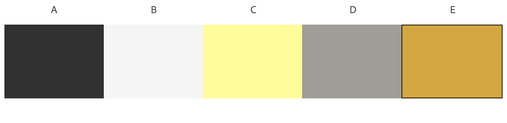

# README

Kayla Molesko

## Netlify Status Badge:

## Description:

This purpose of this project is to provide informaton about myself in a professional and functional website. It was created as a part of Web Development 1 at RVCC.

As I built upon this project, I have learned and practiced a variety of web development skills. 

### Hero

While constructing the hero section, I learned how to write basic html using heading and body text styles, how to insert image files, and how to style them. Styling the selfie on the front helped me master the border-shadow property. 

### Biography and Hobbies

In these sections I learned how to creates paragraphs as well as lists in html and style them in css. I became familiar with the different bulleting styles that can be used for an unordered list. For the biography, I chose to add in a media query for larger screens that shifts the text up into the hero next to the photo, which strengthened my skills using flexbox and columns. 

### Photo Gallery

In my photo gallery, I chose to add a hover effect that zooms into the photo within its container. I did this by creating a container around the image and using the hover and transform properties. In buliding this section I also learned how to work with multiple media queries to adjust the layout as device size increases. I was able to create a two column grid with captions and photos, as well as a three column grid of photos and captions underneath.

### Blog

For my blog section, I chose to research and demonstrate the use of CSS Animation. I learned how to apply animation and created an animated figure for the page. In building this section, I also learned how to create dropcaps using first-letter and adding styling including radial-gradient. For larger screens, I chose to create a media query that seperates the text into two columns.

### Video

Here I learned how to embed a video into a webpage using Youtube. I learned how  to preserve the sizing of the video, by creating a wrapper with specific properties, as well as an iframe inside the wrapper that holds the video. For larger screens, I chose to style this section similar the gallery section in order to prevent the video from becoming too large.

### Contact

Creating the contact section taught me how to work with forms, including how to use netlify to review form submissions. 

### Navbar

In this section I learned how to create a navigation bar with headings that link to each section on the page. I learned how to use the property scroll-behavior in order to make the page scroll smoothly. I also learned how to use the hover effect to highlight the headings. For mobile screens, I created a hamburger style menu using open and close images as labels to be checked and unchecked. I learned how to display different elements depending on whether the label has been checked, or clicked on. When the menu icon is clicked on, it is replaced with a close icon, and the navigation links appear as a list in the center of the page. 

## Color Scheme:

For the main color scheme of my website, I chose to alternate between a dark background with a light yellow text and a light background with dark text. For the main background and sections with dark text, I chose a dark grey rather than black to make the page readable and accessible. Additionally, I used the shade white smoke rather than white for the same reason. 

The dark grey I chose is slightly warm to match the yellow tones of my color scheme.

For accent colors, I chose a light grey, a dark yellow called goldenrod. I also used a very dark grey/black for some small details such as the gradient in my dropcaps. 

I tested my colors for color blind accessbility and contrast and found no conflicts regarding readability of the page. 

**dark grey:** #313131 rgb(49,49,49)  
**whitesmoke:** #F5F5F5 rgb(245,245,245)  
**light yellow:** #FFFD8E rgb(255,253,142)  
**light grey:** #9e9e96 rgb(158,158,150)  
**goldenrod:** #DAA520 (218,165,32)  
**dark grey/black:** #1F1F1F rgb(31,31,31) 

 
*Left to right: dark grey, white smoke, light yellow, light grey, goldenrod* 

## Citations:

## License:

